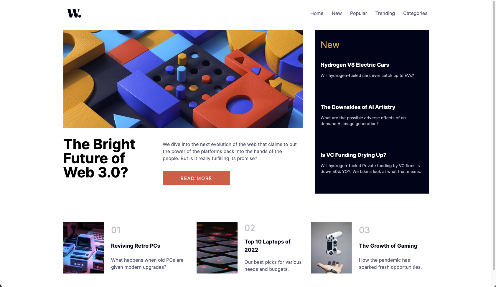
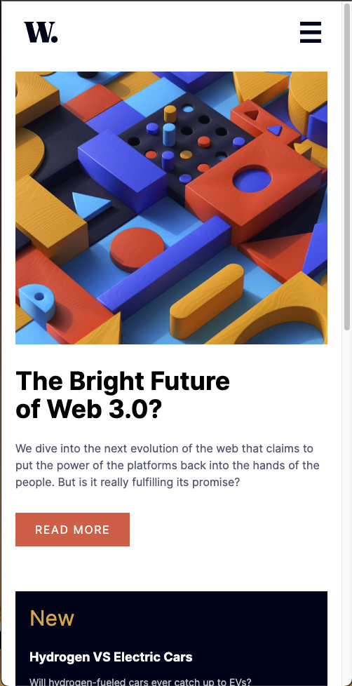
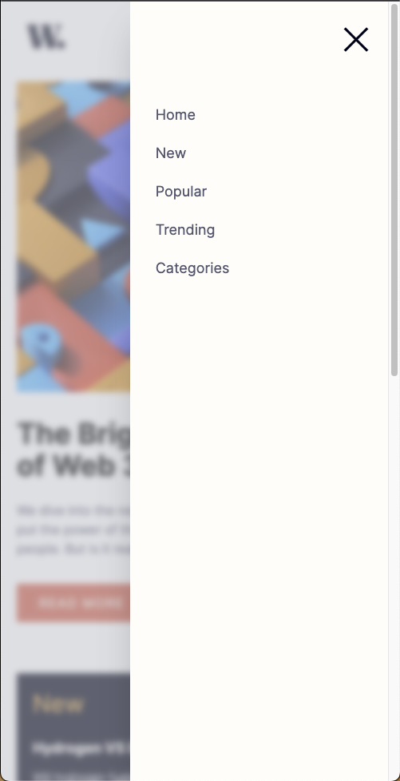

# Frontend Mentor - News homepage solution

This is a solution to the [News homepage challenge on Frontend Mentor](https://www.frontendmentor.io/challenges/news-homepage-H6SWTa1MFl). Frontend Mentor challenges help you improve your coding skills by building realistic projects.

## Table of contents

- [Overview](#overview)
  - [The challenge](#the-challenge)
  - [Screenshot](#screenshot)
  - [Links](#links)
- [My process](#my-process)
  - [Built with](#built-with)
  - [What I learned](#what-i-learned)
  - [Continued development](#continued-development)
- [Author](#author)

## Overview

### The challenge

Users should be able to:

- View the optimal layout for the interface depending on their device's screen size
- See hover and focus states for all interactive elements on the page
- **Bonus**: Toggle the mobile menu (requires some JavaScript)

### Screenshot





### Links

- Solution URL: [LINK](https://www.frontendmentor.io/solutions/news-homepage-using-html-tailwind-css-eoMajXZY_m)
- Live Site URL: [LINK](https://news-homepage-main-w6cw.vercel.app/)

## My process

As always, I started with the mobile design and focused on markup first. Then, starting from the top, I worked on applying styles for layout and appearance, including active/hover states. After that, I moved to desktop, applying CSS Grid to change the layout on the `medium` breakpoint.

Once complete with the basic design, I worked on the mobile menu, first getting the JavaScript correct for toggling the menu, then getting the appearance correct with a blurred content background and navigation links correctly arranged.

### Built with

- Semantic HTML5 markup
- Tailwind CSS
  - Flexbox
  - CSS Grid
- Mobile-first workflow

### What I learned

My skills with layout are continuing to improve the more pages I make. The mobile menu was a big learning. It took a lot of trial and error to figure out how to get the background blur/dimming to work correctly when the menu is toggled. Realizing that I can fix a full width/height container as the element that gets toggled and fix the actual menu to that container was the key to unlocking the feature.

```html
<div
  id="mobile-menu"
  class="hidden bg-neutral-gray-blue w-full h-screen fixed top-0 left-0 bg-opacity-50 backdrop-blur-sm"
>
  <div
    class="bg-neutral-white w-2/3 min-h-screen fixed top-0 right-0 shadow-2xl"
  >
    
    <ul
      class="flex flex-col gap-5 ml-8 fixed top-32 text-lg text-neutral-drk-gry-blue"
    >
      <li class="hover:text-primary-orange cursor-pointer">
        <a href="#hero">Home</a>
      </li>
      <li class="hover:text-primary-orange cursor-pointer">
        <a href="#new">New</a>
      </li>
      <li class="hover:text-primary-orange cursor-pointer">
        <a href="#popular">Popular</a>
      </li>
      <li class="hover:text-primary-orange cursor-pointer">Trending</li>
      <li class="hover:text-primary-orange cursor-pointer">Categories</li>
    </ul>
  </div>
</div>
```

### Continued development

Improving my fundamental skills in CSS are always a big focus on these projects. I'm also learning to use Tailwind CSS well and embrace the utility first paradigm, something I want to continue improving in. I'd also like to get better at transitions and animations in CSS and may take a course in that at some point down the road.

## Author

- Website - [JJ Vega](https://github.com/jjvega86)
- Frontend Mentor - [@jjvega86](https://www.frontendmentor.io/profile/jjvega86)
